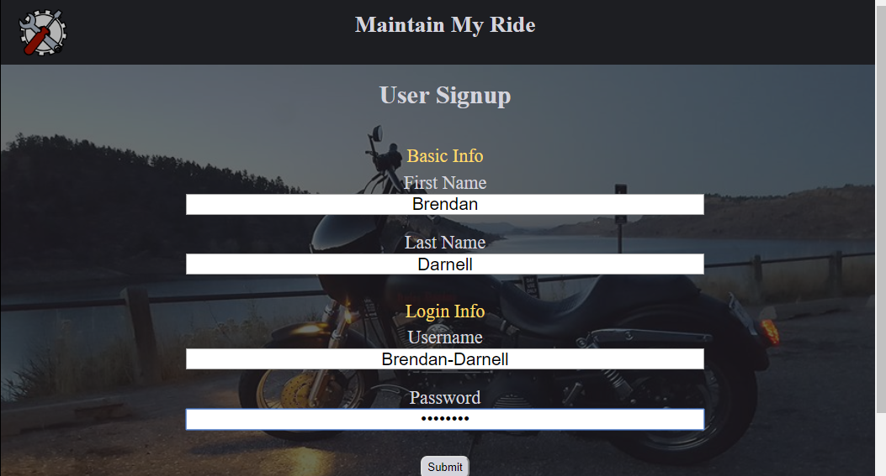
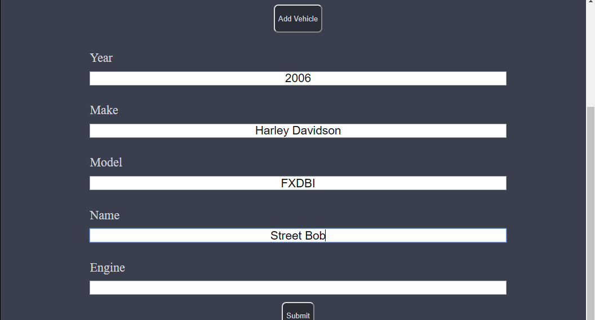
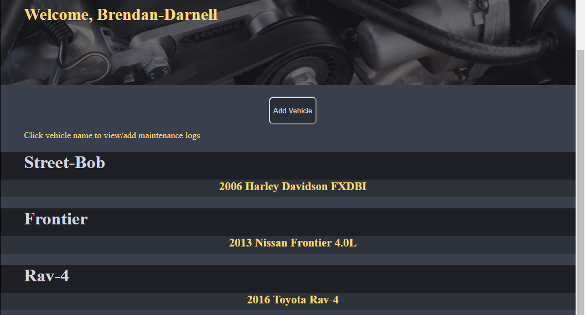
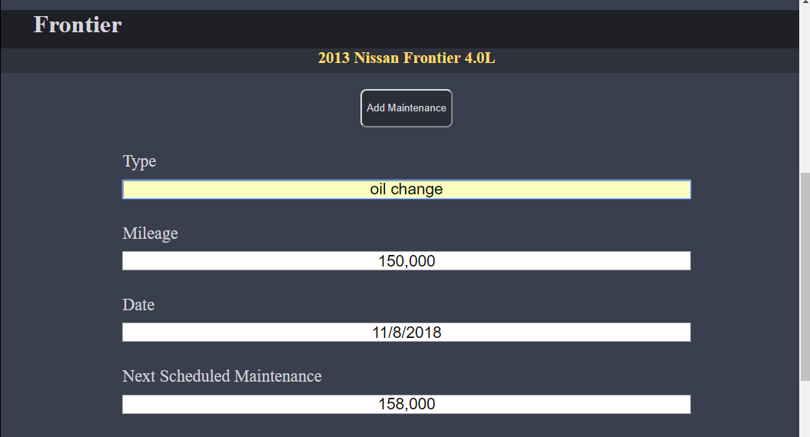
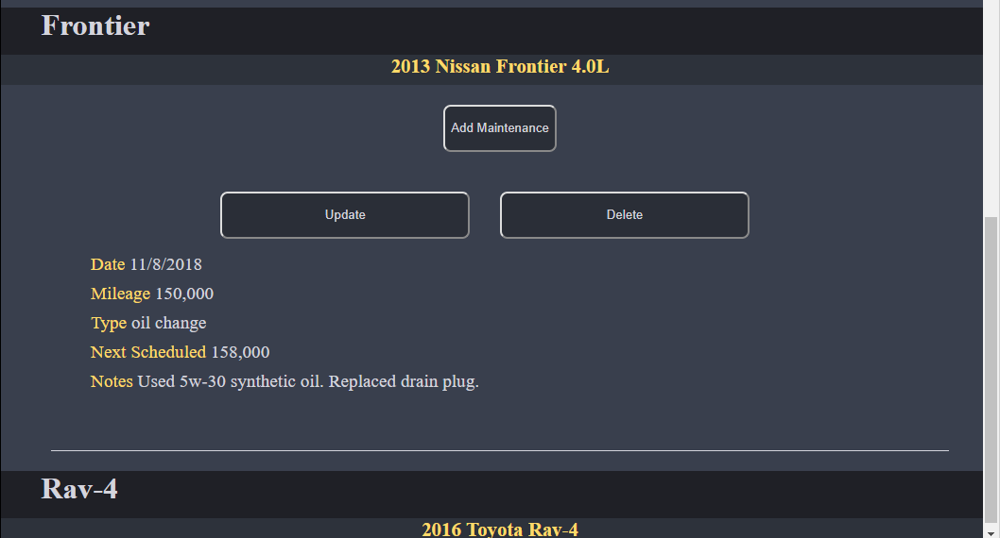

# Maintain My Ride

Maintain My Ride is an app for do-it-yourselfers who want any easy way to keep track of their vehicle maintenance records.  The app allows users to create an account, add all of their vehicles, and log maintenace records for each vehicle.

## Using the App

Create an account or login to an existing account.

Click the add vehicle button to add a vehicle to the account.

Click on a vehicle name to show its maintenance logs.

Click on the add maintenance button to display a form for maintenance logs.

Each maintenance log can be updated or deleted with the click of a button. 

Clicking the update button shows a form where the desired changes can be made. 

## Demo

- [Live Demo](https://shrouded-anchorage-97729.herokuapp.com/)

## Technology Used

* Front-End
    * HTML
    * CSS
    * Javascript
    * JQuery

* Back-End
    * Node
    * Express
    * Mongoose
    * Passport
    * Passport-jwt
    * Jsonwebtoken
    * Bcryptjs

* Testing
    * Mocha
    * Chai
    * Chai-http
    * Faker

## API Documentation

* /signup 
    * Expect a 201 status with user and token in body, otherwise a 400 status.

* /login
    * Expect a 200 status with user and token in body, otherwise a 400 status.

* /vehicles/add
	* Expect a 201 status with user and added vehicle, otherwise a 400 status.

* /maintenance
	* Expect a 200 status with maintenance logs for specified vehicles, otherwise a 400 status.

* /maintenance/add
	* Expect a 201 status with maintenance logs for specified vehicles (including new log), otherwise a 400 status.

* /maintenance/update
	* Expect a 200 status with maintenance logs for specified vehicles (with updated log), otherwise a 400 status.

* /maintenance/delete
	* Expect a 200 status with no response body, otherwise a 400 status.

## Acknowledgements

Jacob Haskins for guidance, useful insights, and suggestions.

