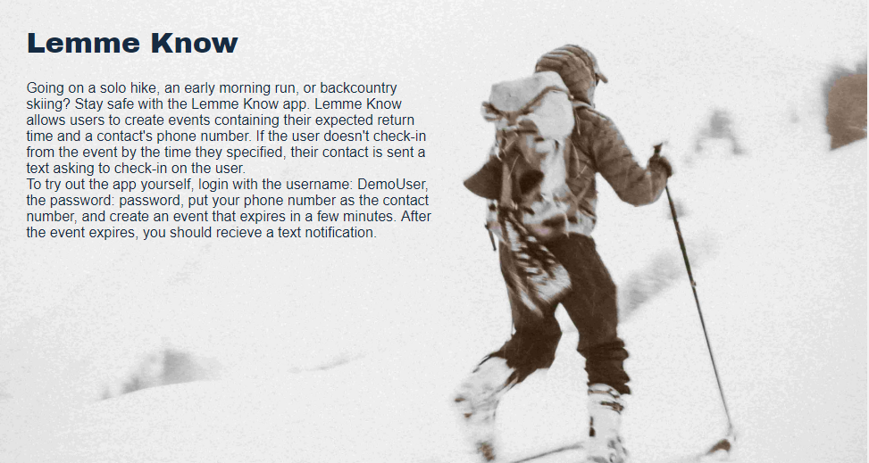
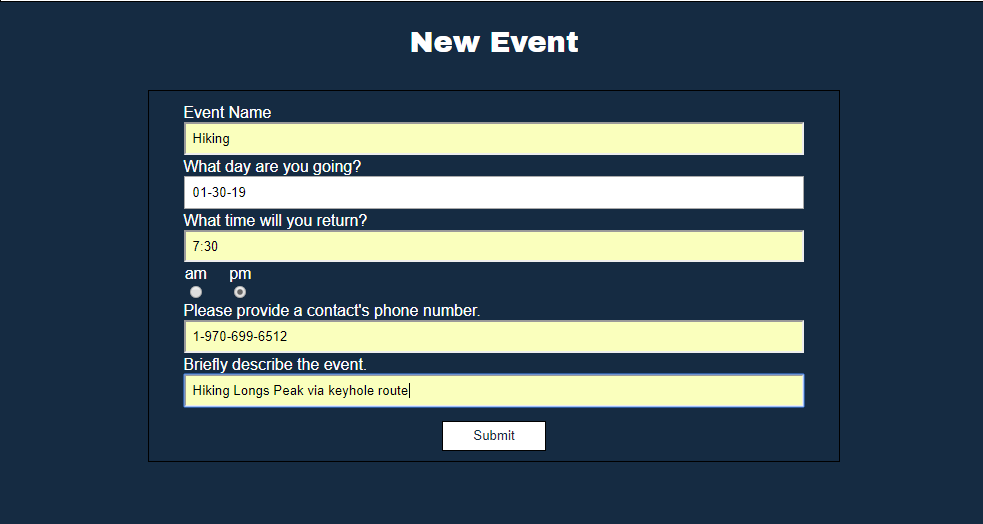
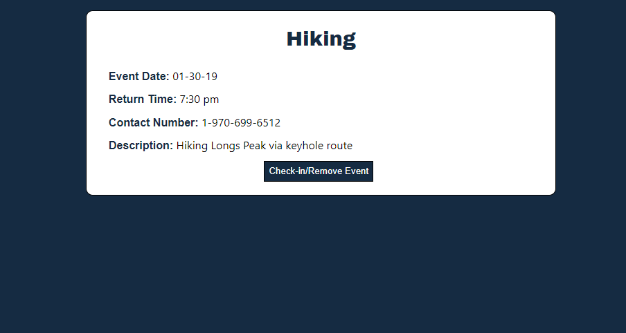

# Lemme Know

Lemmo Know helps people stay safe while enjoying activities they love.  Users create events for upcoming activities, providing
some details about what they are doing, when they are expected to return, and a contact's phone number.  If they do no return
from the event by the specified time, their contact is sent a text asking to check up on the user.

## Using the App

On the landing page, scroll to the bottom to login or click the link to create an account.  To demo the app, the username: DemoUser and password: password can be used to login.

Click the Create Event link in the navigation bar to add a new event.

The My Events page shows upcoming events and allows users to check-in from events that they have returned from. 

## Demo

- [Live Demo](https://sleepy-lake-69131.herokuapp.com/)

## Technology Used

* Front-End
    * HTML
    * CSS
    * Node
    * React
    * React Router
    * Redux
    * Redux Thunk
    * Redux Form
    * Moment
    * Testing 
        * Jest
        * Enzyme

* Back-End
    * Node
    * Express
    * Mongoose
    * Passport
    * Passport-jwt
    * Jsonwebtoken
    * Bcryptjs
    * Twilio
    * Moment
    * Testing
        * Mocha
        * Chai
        * Chai-http
        * Faker

## API Documentation

* /signup 
    * Expect a 201 status with user and token in body, otherwise a 400 status.

* /login
    * Expect a 200 status with user and token in body, otherwise a 400 status.

* /events
    * Expect a 201 status with an array of events, including the created event, for specified user, otherwise a 400 status.

* /events/:username
	* Expect a 200 status with an array of events for specified user, otherwise a 400 status.

* /events/:id
	* Expect a 200 status with an array of events, excluding the deleted event, otherwise a 400 status.

## Acknowledgements

Jacob Haskins for helping me learn React and providing feedback on this app.

